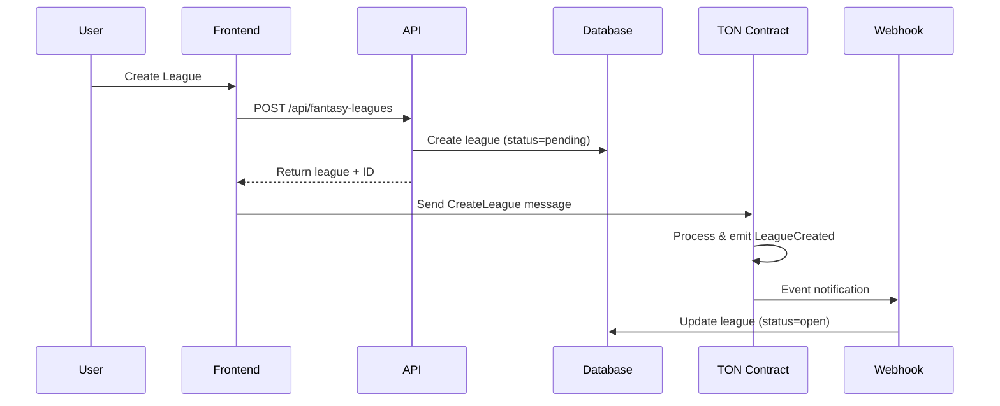

# TON Contract Integration Guide

## Overview

This document provides comprehensive guidance for integrating with the FantasyPro TON smart contract (`LeaguePayout`). The contract handles league creation, staking, and winner payouts on the TON blockchain.

## Contract Information

### Contract Location

- **Source**: [ton-contracts/contracts/league_payout.tact](file:///Users/apple/Documents/fantasypro-rest-api/ton-contracts/contracts/league_payout.tact)
- **Generated Wrapper**: [ton-contracts/build/league_payout/league_payout_LeaguePayout.ts](file:///Users/apple/Documents/fantasypro-rest-api/ton-contracts/build/league_payout/league_payout_LeaguePayout.ts)
- **Tests**: [ton-contracts/tests/league_payout.spec.ts](file:///Users/apple/Documents/fantasypro-rest-api/ton-contracts/tests/league_payout.spec.ts)

### Deployment

- **Deploy Script**: `ton-contracts/scripts/deploy.ts`
- **Command**: `npm run deploy` (from ton-contracts directory)

## Message Types & Opcodes

### 1. CreateLeague

**Opcode**: `226823229` (0x0D86B5DD)

Creates a new fantasy league on the blockchain.

**Fields**:

```typescript
{
  $$type: 'CreateLeague',
  leagueId: string,        // Unique league identifier
  userId: string,          // Creator's user ID
  commissionPercentage: bigint,  // Commission rate (basis points, e.g., 500 = 5%)
  feeAmount: bigint        // Upfront fee in nanoTON (0 if commission-based)
}
```

**Usage Example**:

```typescript
import { LeaguePayout } from "../build/league_payout/tact_LeaguePayout";
import { toNano } from "@ton/core";

const contract = provider.open(await LeaguePayout.fromInit());

await contract.send(
  sender,
  { value: toNano("1.0") }, // Gas + optional fee
  {
    $$type: "CreateLeague",
    leagueId: "league_123",
    userId: "user_1",
    commissionPercentage: 500n, // 5%
    feeAmount: toNano("0.5"), // 0.5 TON upfront fee
  }
);
```

**Events Emitted**:

- `LeagueCreated { leagueId: string }`

### 2. Stake

**Opcode**: `1454696319` (0x56B1BCFF)

Allows a user to stake TON in a league.

**Fields**:

```typescript
{
  $$type: 'Stake',
  leagueId: string,   // League to join
  userId: string,     // Staker's user ID
  amount: bigint      // Stake amount in nanoTON
}
```

**Usage Example**:

```typescript
await contract.send(
  sender,
  { value: toNano("2.0") }, // Must be >= amount + gas
  {
    $$type: "Stake",
    leagueId: "league_123",
    userId: "user_1",
    amount: toNano("1.0"),
  }
);
```

**Events Emitted**:

- `StakeEvent { leagueId: string, userId: string, amount: bigint }`

**Constraints**:

- User can only stake once per league
- League must exist
- Sent value must be >= stake amount

### 3. PayoutWinners

**Opcode**: Auto-generated by Tact

Distributes winnings to league winners (owner-only).

**Fields**:

```typescript
{
  $$type: 'PayoutWinners',
  leagueId: string,
  winners: Dictionary<bigint, Address>,           // Index -> Winner address
  winningPercentages: Dictionary<bigint, bigint>, // Index -> Percentage (basis points)
  count: bigint,                                  // Number of winners
  commissionPercentage: bigint                    // Platform commission (basis points)
}
```

**Events Emitted**:

- `PayoutEvent { leagueId: string, winner: Address, amount: bigint }` (per winner)
- `PayoutCompletedEvent { leagueId: string }`

**Constraints**:

- Only contract owner can call
- Winners must have staked
- If `feePaid` is true, `commissionPercentage` must be 0
- League must have funds

### 4. Withdraw

**Opcode**: Auto-generated by Tact

Allows owner to withdraw excess funds (owner-only).

**Fields**:

```typescript
{
  $$type: 'Withdraw',
  amount: bigint  // Amount to withdraw in nanoTON
}
```

## Contract State

### LeagueInfo

```typescript
{
  owner: Address,
  leagueId: string,
  commissionPercentage: bigint,
  feePaid: boolean,           // True if upfront fee was paid
  totalStaked: bigint         // Total TON staked in league
}
```

### StakeInfo

```typescript
{
  user: Address,
  amount: bigint,
  hasStaked: boolean
}
```

## Integration Architecture

### Backend Flow



### Current Implementation

1. **API Layer** ([fantasy-leagues-route.ts](file:///Users/apple/Documents/fantasypro-rest-api/src/features/fantasy-leagues/fantasy-leagues-route.ts))

   - Creates DB records with `status='pending'`
   - Returns league ID to frontend
   - Frontend responsible for blockchain transaction

2. **Webhook Handler** ([ton-webhook-route.ts](file:///Users/apple/Documents/fantasypro-rest-api/src/features/webhooks/ton-webhook-route.ts))

   - Receives events from TON blockchain
   - Updates DB records based on events:
     - `LeagueCreated` → status='open'
     - `StakeEvent` → membership status='active'
     - `PayoutEvent` → membership status='won'
     - `PayoutCompletedEvent` → league status='completed'

3. **Blockchain Service** ([ton-blockchain.service.ts](file:///Users/apple/Documents/fantasypro-rest-api/src/infrastructure/blockchain/ton-blockchain.service.ts))
   - Currently stub implementation
   - Only `payoutWinners` method (returns mock hash)
   - **TODO**: Implement actual contract interactions

## Frontend Integration

### Required Dependencies

```json
{
  "@ton/core": "^0.62.0",
  "@ton/ton": "^16.1.0",
  "@tonconnect/ui-react": "^2.x" // For wallet connection
}
```

### Example: Creating a League

```typescript
import { useTonConnect } from "@tonconnect/ui-react";
import { Address, toNano, beginCell } from "@ton/core";
import { LeaguePayout } from "./contracts/LeaguePayout";

function CreateLeagueButton({ leagueId, userId, commission, fee }) {
  const { sender } = useTonConnect();

  const handleCreate = async () => {
    // 1. Call API to create DB record
    const response = await fetch("/api/fantasy-leagues", {
      method: "POST",
      body: JSON.stringify({
        id: leagueId,
        name: "My League",
        // ... other fields
      }),
    });

    const { league } = await response.json();

    // 2. Send blockchain transaction
    const contractAddress = Address.parse(process.env.CONTRACT_ADDRESS);
    const contract = LeaguePayout.fromAddress(contractAddress);

    await contract.send(
      sender,
      {
        value: toNano("1.0"), // Adjust based on fee
      },
      {
        $$type: "CreateLeague",
        leagueId: league.id,
        userId: userId,
        commissionPercentage: BigInt(commission),
        feeAmount: toNano(fee),
      }
    );

    // 3. Wait for webhook to update status
    // (Poll API or use WebSocket for real-time updates)
  };

  return <button onClick={handleCreate}>Create League</button>;
}
```

## Webhook Setup

### Endpoint

- **URL**: `https://your-api-domain.com/api/webhooks/ton`
- **Method**: POST
- **Handler**: [ton-webhook-route.ts](file:///Users/apple/Documents/fantasypro-rest-api/src/features/webhooks/ton-webhook-route.ts)

### Provider Configuration

Use **TonConsole** or **TonAPI** to monitor contract events:

1. Register at [tonconsole.com](https://tonconsole.com) or [tonapi.io](https://tonapi.io)
2. Add webhook:
   - **Contract Address**: Your deployed LeaguePayout address
   - **Endpoint**: `https://fantasy-pro-api.onrender.com/api/webhooks/ton`
   - **Events**: All events (LeagueCreated, StakeEvent, PayoutEvent, PayoutCompletedEvent)

### Event Structure

The webhook expects events in this format:

```json
{
  "events": [
    {
      "event_id": "tx_hash",
      "actions": [
        {
          "type": "SmartContractExec",
          "SmartContractExec": {
            "operation": "LeagueCreated",
            "payload": {
              "leagueId": "league_123"
            }
          }
        }
      ]
    }
  ]
}
```

## Testing

### Run Contract Tests

```bash
cd ton-contracts
npm test
```

### Test Coverage

- ✅ League creation (with/without fee)
- ✅ Staking (single/multiple users)
- ✅ Payout distribution
- ✅ Commission handling
- ✅ Access control (owner-only functions)
- ✅ Error cases (double stake, invalid winner, etc.)

## Common Issues & Solutions

### Issue: "Contract failed error" when creating/joining

**Possible Causes**:

1. **Wrong opcode**: Ensure using generated wrapper, not manual construction
2. **Insufficient gas**: Send enough TON to cover gas + stake/fee
3. **Wrong contract address**: Verify deployed contract address
4. **Message structure mismatch**: Use generated wrapper types

**Solution**:

```typescript
// ❌ DON'T: Manual opcode construction
const body = beginCell()
  .storeUint(123456789, 32) // Wrong opcode!
  .storeStringRefTail(leagueId)
  .endCell();

// ✅ DO: Use generated wrapper
import { storeCreateLeague } from "./build/league_payout/league_payout_LeaguePayout";

const body = beginCell()
  .store(
    storeCreateLeague({
      $$type: "CreateLeague",
      leagueId,
      userId,
      commissionPercentage,
      feeAmount,
    })
  )
  .endCell();
```

### Issue: Webhook not receiving events

**Solutions**:

1. Verify webhook URL is publicly accessible
2. Check contract address in webhook provider
3. Ensure contract is deployed to correct network (testnet/mainnet)
4. Review webhook logs in provider dashboard

## Environment Variables

```env
# TON Configuration
TON_ENDPOINT=https://testnet.toncenter.com/api/v2/jsonRPC
TON_MNEMONIC=your 24 word mnemonic phrase
TON_CONTRACT_ADDRESS=EQxxxxxxxxxxxxxxxxxxxxxxxxxxxxx

# Webhook
WEBHOOK_URL=https://your-api.com/api/webhooks/ton
```

## Next Steps

1. **Implement Frontend Integration**

   - Add TON Connect wallet integration
   - Implement contract message sending
   - Add transaction status polling

2. **Complete Backend Service**

   - Implement `ton-blockchain.service.ts` methods
   - Add contract address management
   - Implement payout automation

3. **Deploy Contract**

   - Deploy to TON testnet
   - Configure webhook provider
   - Test end-to-end flow

4. **Production Deployment**
   - Deploy to TON mainnet
   - Update environment variables
   - Monitor webhook events

## Resources

- [TON Documentation](https://docs.ton.org/)
- [Tact Language](https://tact-lang.org/)
- [TON Connect](https://docs.ton.org/develop/dapps/ton-connect/overview)
- [TonAPI](https://tonapi.io/docs)
