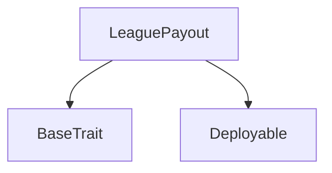
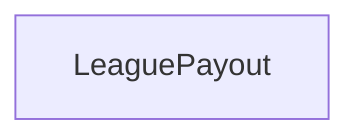

# Tact compilation report
Contract: LeaguePayout
BoC Size: 2342 bytes

## Structures (Structs and Messages)
Total structures: 26

### DataSize
TL-B: `_ cells:int257 bits:int257 refs:int257 = DataSize`
Signature: `DataSize{cells:int257,bits:int257,refs:int257}`

### SignedBundle
TL-B: `_ signature:fixed_bytes64 signedData:remainder<slice> = SignedBundle`
Signature: `SignedBundle{signature:fixed_bytes64,signedData:remainder<slice>}`

### StateInit
TL-B: `_ code:^cell data:^cell = StateInit`
Signature: `StateInit{code:^cell,data:^cell}`

### Context
TL-B: `_ bounceable:bool sender:address value:int257 raw:^slice = Context`
Signature: `Context{bounceable:bool,sender:address,value:int257,raw:^slice}`

### SendParameters
TL-B: `_ mode:int257 body:Maybe ^cell code:Maybe ^cell data:Maybe ^cell value:int257 to:address bounce:bool = SendParameters`
Signature: `SendParameters{mode:int257,body:Maybe ^cell,code:Maybe ^cell,data:Maybe ^cell,value:int257,to:address,bounce:bool}`

### MessageParameters
TL-B: `_ mode:int257 body:Maybe ^cell value:int257 to:address bounce:bool = MessageParameters`
Signature: `MessageParameters{mode:int257,body:Maybe ^cell,value:int257,to:address,bounce:bool}`

### DeployParameters
TL-B: `_ mode:int257 body:Maybe ^cell value:int257 bounce:bool init:StateInit{code:^cell,data:^cell} = DeployParameters`
Signature: `DeployParameters{mode:int257,body:Maybe ^cell,value:int257,bounce:bool,init:StateInit{code:^cell,data:^cell}}`

### StdAddress
TL-B: `_ workchain:int8 address:uint256 = StdAddress`
Signature: `StdAddress{workchain:int8,address:uint256}`

### VarAddress
TL-B: `_ workchain:int32 address:^slice = VarAddress`
Signature: `VarAddress{workchain:int32,address:^slice}`

### BasechainAddress
TL-B: `_ hash:Maybe int257 = BasechainAddress`
Signature: `BasechainAddress{hash:Maybe int257}`

### Deploy
TL-B: `deploy#946a98b6 queryId:uint64 = Deploy`
Signature: `Deploy{queryId:uint64}`

### DeployOk
TL-B: `deploy_ok#aff90f57 queryId:uint64 = DeployOk`
Signature: `DeployOk{queryId:uint64}`

### CreateLeague
TL-B: `create_league#d68206e7 leagueId:^string userId:^string commissionPercentage:uint64 feeAmount:coins initialStake:coins = CreateLeague`
Signature: `CreateLeague{leagueId:^string,userId:^string,commissionPercentage:uint64,feeAmount:coins,initialStake:coins}`

### Stake
TL-B: `stake#56b4e77f leagueId:^string userId:^string amount:coins = Stake`
Signature: `Stake{leagueId:^string,userId:^string,amount:coins}`

### CreatePublicLeague
TL-B: `create_public_league#5730951b leagueId:^string commissionPercentage:uint64 feeAmount:coins = CreatePublicLeague`
Signature: `CreatePublicLeague{leagueId:^string,commissionPercentage:uint64,feeAmount:coins}`

### PayoutWinners
TL-B: `payout_winners#a12dd911 leagueId:^string winningPercentages:dict<int, int> winners:dict<int, address> count:uint8 commissionPercentage:uint64 = PayoutWinners`
Signature: `PayoutWinners{leagueId:^string,winningPercentages:dict<int, int>,winners:dict<int, address>,count:uint8,commissionPercentage:uint64}`

### PayoutItem
TL-B: `_ leagueId:^string winningPercentages:dict<int, int> winners:dict<int, address> count:uint8 commissionPercentage:uint64 = PayoutItem`
Signature: `PayoutItem{leagueId:^string,winningPercentages:dict<int, int>,winners:dict<int, address>,count:uint8,commissionPercentage:uint64}`

### BatchPayoutWinners
TL-B: `batch_payout_winners#2c578785 items:dict<int, ^PayoutItem{leagueId:^string,winningPercentages:dict<int, int>,winners:dict<int, address>,count:uint8,commissionPercentage:uint64}> count:uint8 = BatchPayoutWinners`
Signature: `BatchPayoutWinners{items:dict<int, ^PayoutItem{leagueId:^string,winningPercentages:dict<int, int>,winners:dict<int, address>,count:uint8,commissionPercentage:uint64}>,count:uint8}`

### Withdraw
TL-B: `withdraw#0ba69751 amount:coins = Withdraw`
Signature: `Withdraw{amount:coins}`

### LeagueCreated
TL-B: `league_created#44f03929 leagueId:^string = LeagueCreated`
Signature: `LeagueCreated{leagueId:^string}`

### StakeEvent
TL-B: `stake_event#61ac041c leagueId:^string userId:^string amount:coins = StakeEvent`
Signature: `StakeEvent{leagueId:^string,userId:^string,amount:coins}`

### PayoutEvent
TL-B: `payout_event#43bc9223 leagueId:^string winner:address amount:coins = PayoutEvent`
Signature: `PayoutEvent{leagueId:^string,winner:address,amount:coins}`

### PayoutCompletedEvent
TL-B: `payout_completed_event#3a5ba866 leagueId:^string = PayoutCompletedEvent`
Signature: `PayoutCompletedEvent{leagueId:^string}`

### LeaguePayout$Data
TL-B: `_ owner:address leagues:dict<int, ^LeagueInfo{owner:address,leagueId:^string,commissionPercentage:int257,feePaid:bool,totalStaked:coins}> stakes:dict<int, ^StakeInfo{user:address,amount:int257,hasStaked:bool}> = LeaguePayout`
Signature: `LeaguePayout{owner:address,leagues:dict<int, ^LeagueInfo{owner:address,leagueId:^string,commissionPercentage:int257,feePaid:bool,totalStaked:coins}>,stakes:dict<int, ^StakeInfo{user:address,amount:int257,hasStaked:bool}>}`

### LeagueInfo
TL-B: `_ owner:address leagueId:^string commissionPercentage:int257 feePaid:bool totalStaked:coins = LeagueInfo`
Signature: `LeagueInfo{owner:address,leagueId:^string,commissionPercentage:int257,feePaid:bool,totalStaked:coins}`

### StakeInfo
TL-B: `_ user:address amount:int257 hasStaked:bool = StakeInfo`
Signature: `StakeInfo{user:address,amount:int257,hasStaked:bool}`

## Get methods
Total get methods: 1

## league
Argument: id

## Exit codes
* 2: Stack underflow
* 3: Stack overflow
* 4: Integer overflow
* 5: Integer out of expected range
* 6: Invalid opcode
* 7: Type check error
* 8: Cell overflow
* 9: Cell underflow
* 10: Dictionary error
* 11: 'Unknown' error
* 12: Fatal error
* 13: Out of gas error
* 14: Virtualization error
* 32: Action list is invalid
* 33: Action list is too long
* 34: Action is invalid or not supported
* 35: Invalid source address in outbound message
* 36: Invalid destination address in outbound message
* 37: Not enough Toncoin
* 38: Not enough extra currencies
* 39: Outbound message does not fit into a cell after rewriting
* 40: Cannot process a message
* 41: Library reference is null
* 42: Library change action error
* 43: Exceeded maximum number of cells in the library or the maximum depth of the Merkle tree
* 50: Account state size exceeded limits
* 128: Null reference exception
* 129: Invalid serialization prefix
* 130: Invalid incoming message
* 131: Constraints error
* 132: Access denied
* 133: Contract stopped
* 134: Invalid argument
* 135: Code of a contract was not found
* 136: Invalid standard address
* 138: Not a basechain address
* 5902: Winner did not stake
* 9821: League already exists
* 18492: Insufficient stake amount sent
* 19126: Only owner can create public leagues
* 26825: Only owner can withdraw
* 35380: Only owner can payout
* 44175: Fee paid, no commission allowed
* 58396: User already staked
* 62070: No funds in league
* 62441: Insufficient value sent

## Trait inheritance diagram

## Contract dependency diagram

